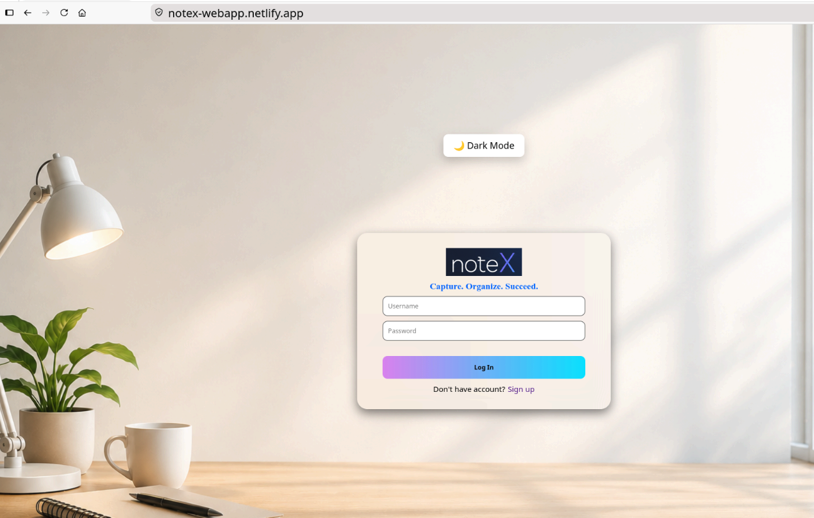
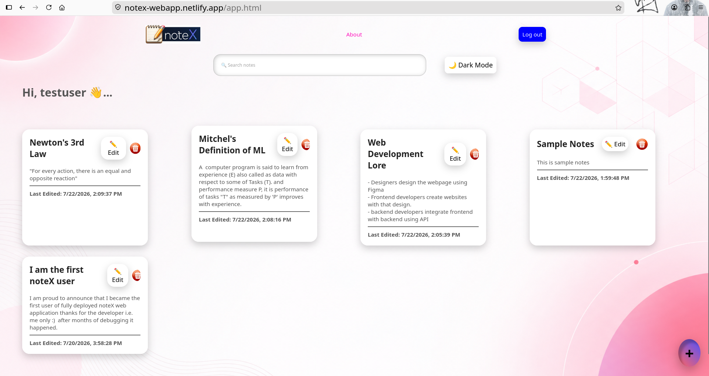
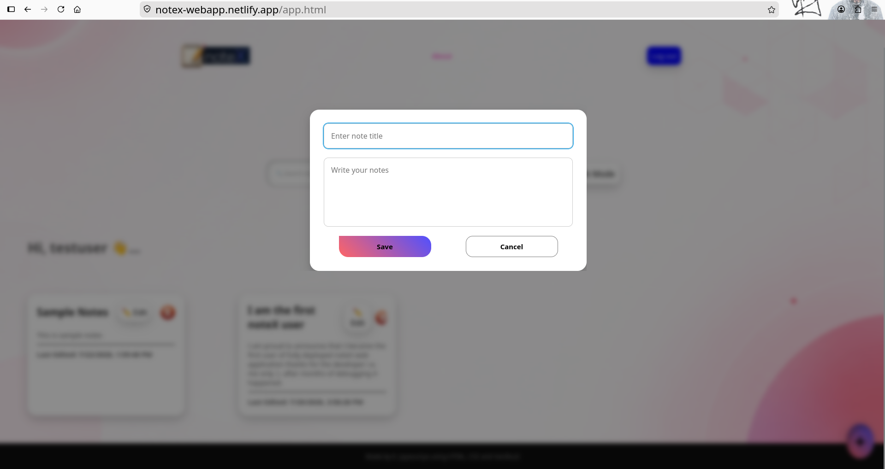
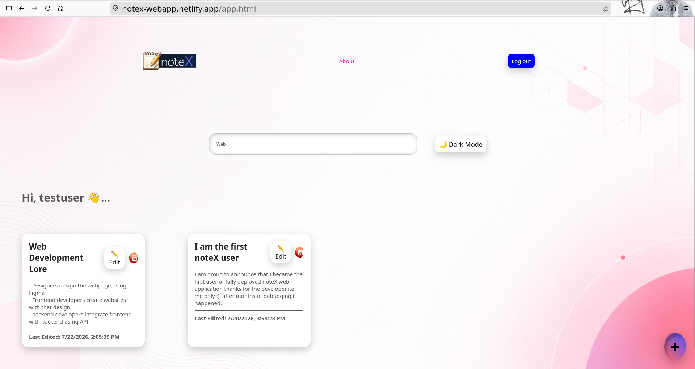
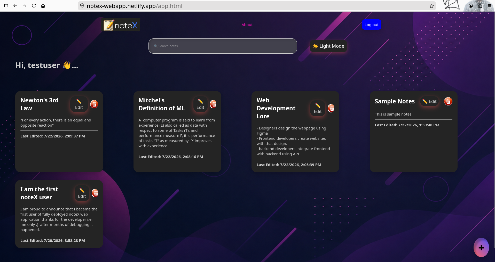
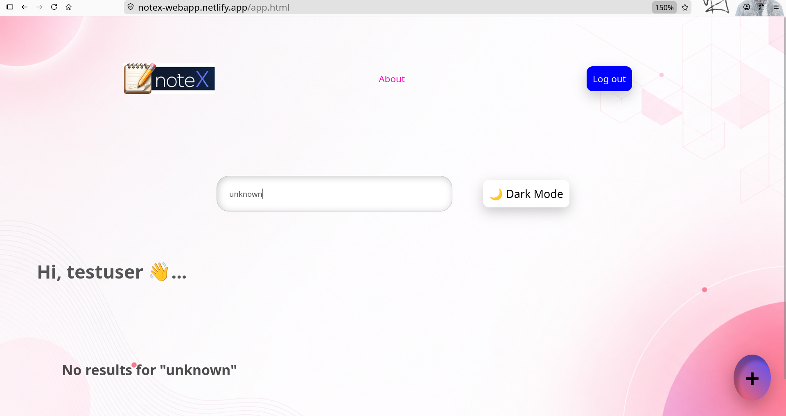

# 📝 NoteX

A modern full-stack note-taking application built with **FastAPI**, **PostgreSQL**, and **Vanilla JavaScript**. Users can securely register, log in using JWT authentication, and manage their notes from anywhere.

🌐 **Live Demo:** https://notex-webapp.netlify.app

📖 **API Documentation:** https://notex-api-4e3s.onrender.com/docs

---

## ✨ Features

- 🔐 Secure User Registration
- 🔑 JWT Authentication
- 📝 Create Notes
- 📖 Read Notes
- ✏️ Update Notes
- 🗑️ Delete Notes
- 🌙 Dark / Light Theme
- 💾 Persistent Cloud Database (Neon PostgreSQL)
- 📱 Responsive User Interface
- 📚 Interactive Swagger API Documentation

---

## 🖼️ Screenshots

### 1. Home Page

<p align="center">
  
</p>

---

### 2. Dashboard

<p align="center">
  
</p>

---

### 3. Taking Notes

<p align="center">
  
</p>

---

### 4. Search Notes

<p align="center">
  
</p>

---

### 5. Dark Mode

<p align="center">
  
</p>

---

### 6. No Results

<p align="center">
  
</p>

---

### 7. Swagger API

<p align="center">
  
</p>

# 🏗️ Tech Stack

## Frontend

- HTML5
- CSS3
- Vanilla JavaScript

## Backend

- FastAPI
- Python
- JWT Authentication
- bcrypt Password Hashing

## Database

- PostgreSQL
- Neon Cloud Database

## Deployment

- Netlify (Frontend)
- Render (Backend)
- Neon (Database)

---

# 📂 Project Structure

```
notex
|
├── assets
│   ├── darkmode.png
│   ├── dashboard.png
│   ├── home.png
│   ├── no-results.png
│   ├── searchnotes.png
│   └── taking-notes.png
├── backend
│   ├── app
│   ├── requirements.txt
│   ├── run.py
│   ├── runtime.txt
│   └── test.py
├── database
│   ├── README.md
│   ├── schema.sql
│   └── seed.sql
├── frontend
│   ├── app.html
│   ├── assets
│   ├── css
│   ├── index.html
│   ├── js
│   └── register.html
├── README.md
└── tests

```

---

# 🚀 Live Deployment

## Frontend

https://notex-webapp.netlify.app

## Backend API

https://notex-api-4e3s.onrender.com

## Swagger Documentation

https://notex-api-4e3s.onrender.com/docs

---

# 🔐 Authentication

The application uses **JSON Web Tokens (JWT)**.

After a successful login:

- A JWT token is generated.
- The frontend stores the token.
- Every protected request sends

```
Authorization: Bearer <JWT_TOKEN>
```

Protected endpoints include:

- GET /notes
- POST /notes
- PUT /notes/{id}
- DELETE /notes/{id}

---

# 📖 API Endpoints

## Authentication

| Method | Endpoint | Description |
|---------|----------|-------------|
| POST | `/register` | Register new user |
| POST | `/login` | Login user |

---

## Notes

| Method | Endpoint | Description |
|---------|----------|-------------|
| GET | `/notes` | Get all notes |
| POST | `/notes` | Create note |
| PUT | `/notes/{id}` | Update note |
| DELETE | `/notes/{id}` | Delete note |

---

# 💻 Local Installation

## Clone Repository

```bash
git clone https://github.com/KJayasuriya/quick-notes.git
cd quick-notes
```

---

## Backend Setup

```bash
cd backend

python -m venv venv

source venv/bin/activate
```

Install dependencies

```bash
pip install -r requirements.txt
```

Create a `.env` file:

```env
DB_HOST=<database_host>
DB_PORT=<database_port>
DB_NAME=<database_name>
DB_USER=<database_user>
DB_PASSWORD=<database_password>

JWT_SECRET_KEY=<your_jwt_secret>
JWT_ALGORITHM=HS256
JWT_EXPIRE_MINUTES=60
```

Run server

```bash
python run.py
```

---

## Frontend

Open

```
frontend/index.html
```

using Live Server.

---

# Database

Run

```
database/schema.sql
```

inside PostgreSQL.

---

# Future Improvements

- Note Categories
- Rich Text Editor
- Password Reset
- User Profile
- Pagination
- Unit Testing
- Docker Support

---

# Author

**K. Jayasuriya**

GitHub

https://github.com/KJayasuriya

---

# License

This project is licensed under the MIT License.
